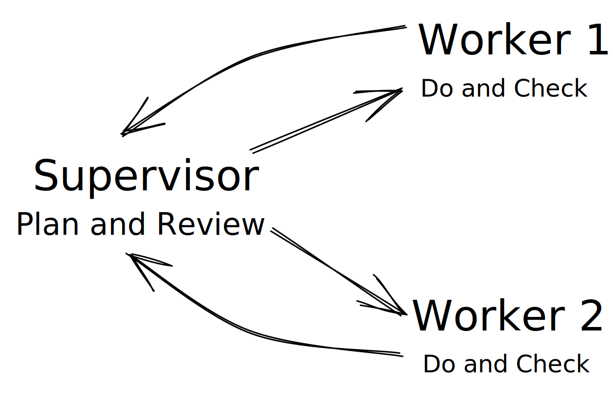

# agi-actors: Exploring the Potential of AGI Actors through PDCA and Concurrency

Welcome to agi-actors, a proof-of-concept Python project that demonstrates the possibilities of combining AGI concepts like BabyAGI and AutoGPT with the Plan-Do-Check-Adjust (PDCA) cycle, and the actor model of concurrency for managing large language models (LLMs). agi-actors aims to inspire the LLM community, emphasizing the untapped potential of the actor model of concurrency as applied to generative agents and encouraging further exploration and development.

## How it works



1. A **Plan** is made by a **Supervisor** for a given objective, and a semantic zero-shot topological sort is performed on the plan's tasks to adequately distribute tasks across workers.
2. **Workers** use the ReAct framework to **Do** a task and then **Check** it, improving their work if required.
3. **Supervisor** reviews the results of tasks in the **Adjust** phase and decides whether to loop back to planning or to terminate.

```
(Supervisor pid=98003) OBJECTIVE: How do we ensure the safe development of AGI?
(Supervisor pid=98003) Agent 1
(Supervisor pid=98003) [1.1] Research and implement safety measures for AGI development
(Supervisor pid=98003) [1.2] Implement explainability and interpretability features for AGI (depends on [1.1])
(Supervisor pid=98003) [1.3] Develop and implement fail-safe mechanisms for AGI (depends on [1.2])
(Supervisor pid=98003) Agent 2
(Supervisor pid=98003) [2.1] Develop and implement a comprehensive testing framework for AGI
(Supervisor pid=98003) [2.2] Conduct extensive testing on AGI using the testing framework (depends on [2.1])
(Supervisor pid=98003) [2.3] Analyze and report on the results of the testing (depends on [2.2])
(Worker pid=98046)
(Worker pid=98046) *****WORKER STARTING*****
(Worker pid=98046) [1.1] Research and implement safety measures for AGI development
(Worker pid=98047)
(Worker pid=98047) *****WORKER STARTING*****
(Worker pid=98047) [2.1] Develop and implement a comprehensive testing framework for AGI
```

## Key Features

* **Plan-Do-Check-Adjust (PDCA) Cycle**: The supervisory agent does, allowing for continuous improvement and optimization of the work distribution and execution process among worker agents.

* **Actor Model of Concurrency**: agi-actors implements the actor model, where a supervisor agent has worker agents that complete sub-tasks in parallel independently.

## Limitations

This was only tested on GPT-3.5-Turbo, and not GPT-4, because we don't have an API token.

## Request for Contributors

We invite contributors to join us in expanding agi-actors by exploring the following ideas:

1. **Improved Agent Prompts**: Develop better prompts for the Plan, Do, Check, and Adjust chains
2. **Implement Agent Memory**: Using
3. **Iterative Frontend**: Develop a frontend interface for exploring the execution tree of AGI Actors, allowing researchers to better understand and visualize the interaction between the supervisory agent and worker agents.
4. **Generalized Framework**: Build a more generalized framework for LLMs, moving beyond the specific implementation of PDCA agents and exploring other possibilities for AGI Actors.

## Acknowledgments

We extend our gratitude to the two Python packages, langchain and ray, which have significantly contributed to the development of agi-actors.

Together, let's explore the potential of AGI Actors and inspire the LLM community to delve deeper into this exciting area of research.

## Development

1. Clone the repo
2. `poetry install --with dev --with typing`

Make sure to run `poetry shell` to activate the virtual env!

### REPL-Driven Development

```bash
poetry run ipython
```

### Tests

```bash
poetry run pytest -s # run all tests
poetry run pytest -s -k 'thinking' # How can we ensure the safe development of AGI?
```
