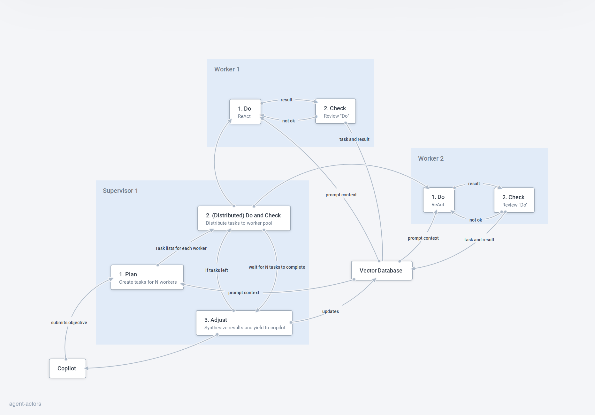

# agent-actors: The Potential of AGI with Plan-Do-Check-Adjust and the Actor Model of Concurrency

Welcome to agent-actors, a proof-of-concept Python project that demonstrates the possibilities of combining AGI proof-of-concepts like BabyAgent and AutoGPT with the Plan-Do-Check-Adjust (PDCA) cycle, as well as the actor model of concurrency for managing large language models (LLMs). agent-actors aims to inspire the LLM community, emphasizing the untapped potential of the actor model of concurrency as applied to generative agents and encouraging further exploration and development.

## Demo Video
[](https://www.youtube.com/watch?v=XiHiOfYOAmc)

## Key Features

* **Plan-Do-Check-Adjust (PDCA) Cycle**: The supervisory agent does, allowing for continuous improvement and optimization of the work distribution and execution process among worker agents. This is an iteration on the decision models of other AutoGPT implementations.
* **Actor Model of Concurrency**: agent-actors implements the actor model, where a supervisor agent has worker agents that complete sub-tasks in parallel independently.
* **Agent Working Memory**: Agents have their own local working memory synthesized from a global memory store to inject into their prompts as context. Agents also score the relevance of their new memories (a la Generative Agents: Interactive Simulacra of Human Behavior)

## How it works



1. A copilot submits an objective to a **Supervisor**, along with a set of worker agents. The supervisor which makes a **Plan** and distributes the tasks to its worker agents.
2. **Workers** use the ReAct framework to **Do** a task with an added **Check** to improve their work if required.
3. **Supervisor** reviews the results of tasks in the **Adjust** phase and decides whether to loop back to planning or to terminate.

## Limitations

This was only tested on GPT-3.5-Turbo, and not GPT-4. We encourage experimentation here .

## Request for Contributors

We invite contributors to join us in expanding agent-actors by exploring the following ideas:

1. **Improved Agent Prompts**: Develop better prompts for the Plan, Do, Check, and Adjust chains
2. **Visualization Tooling**: Develop an interface for exploring the execution tree of Agent Actors, allowing researchers to better understand and visualize the interaction between the supervisory agent and worker agents.
3. **Nested Supervisors**: Experiment with having nested supervision trees

## Acknowledgments

We extend our gratitude to the two Python packages, langchain and ray, which have significantly contributed to the development of agent-actors.

Together, let's explore the potential of Agent Actors and inspire the LLM community to delve deeper into this exciting area of research.

## Development

1. Clone the repo
2. `poetry install --with dev --with typing`

Make sure to run `poetry shell` to activate the virtual env!

### REPL-Driven Development

```bash
poetry run ipython
```

### Tests

```bash
poetry run pytest -s # run all tests
poetry run pytest -s -k 'thinking' # How can we ensure the safe development of Agent?
```

## License

BUSL-1.1

## Citation

Citation
Please cite the repo if you use the data or code in this repo.

```
@misc{agiactors,
  author = {Shaman AI},
  title = {agent-actors: The Potential of Agent with Plan-Do-Check-Adjust and the Actor Model of Concurrency},
  year = {2023},
  publisher = {GitHub},
  journal = {GitHub repository},
  howpublished = {\url{https://github.com/shaman-ai/agent-actors}},
}
```
